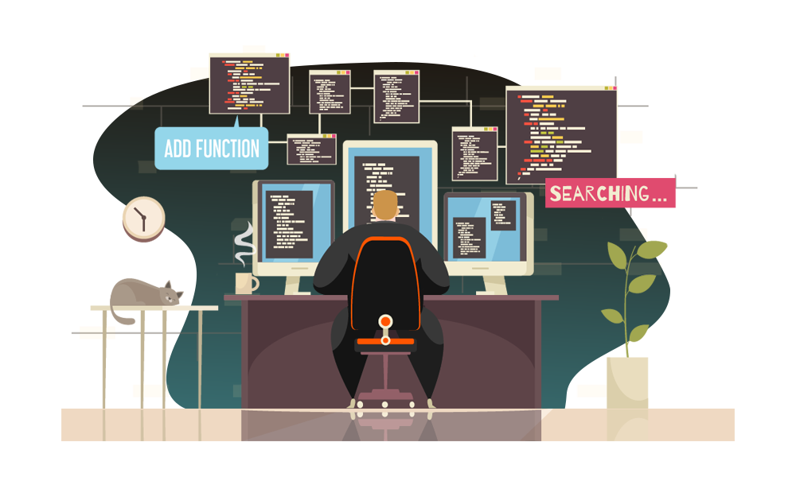

# Flávio P. Baptista

Olá, seja muito bem-vindo ao meu GitHub!
 
 
Sou um profissional persistente e dedicado, em busca de desafios e oportunidades de crescimento na área de Tecnologia da Informação. Atualmente, sou graduado Tecnólogo em Análise e Desenvolvimento de Sistemas.
 
 
Atualmente me especializando em Análise de Dados, com conhecimentos sólidos em Excel e em processo de aprendizagem contínua em SQL e Power BI. Tenho como próximos objetivos o aprofundamento em matemática, estatística, técnicas de storytelling com dados e Python. Sou autodidata, curioso por natureza e estou sempre em busca de evoluir profissionalmente nessa área dinâmica e em constante transformação.
 
 
Além da minha formação, também possuo conhecimentos em HTML, CSS e familiaridade com JavaScript. Já tive contato com frameworks e ferramentas como Bootstrap, Next.js, React e Firebase. Tenho noções básicas de versionamento com Git e GitHub. Também tenho habilidades com ferramentas de design e edição, como Photoshop CS6, Figma, Filmora Wondershare e CapCut. Essas experiências complementares ampliam minha visão técnica e criativa, contribuindo para projetos mais completos e bem estruturados.
 
 
Estou disponível para contatos e novos desafios, conecte-se comigo e me convide para um bate-papo. Será um prazer responder às suas perguntas e discutir possíveis oportunidades de colaboração.

## Conecte-se comigo

## Habilidades

## Card - Most Used Languages

## Card - Streak

 

  

 

  ## Attributions and references
 
  - Badges by <a href="https://shields.io/">shields.io</a> 
  - GitHub Stats by <a href="https://github.com/anuraghazra/github-readme-stats">anuraghazra</a>
  - O programador created by <a href="https://br.freepik.com/vetores-gratis/o-programador-trabalha-com-ilustracao-plana-dos-simbolos-do-dia-de-trabalho_15329611.htm#page=5&query=developer&position=31&from_view=search&track=sph#position=31&page=5&query=developer">Imagem de macrovector</a> no Freepik  
  - Template inspired by - <a href="https://github.com/elidianaandrade">Elidiana Andrade</a>
   
   
   

 
  
Modified by <a href="https://github.com/flaviobaptista">Flávio P. Baptista</a>.

     

